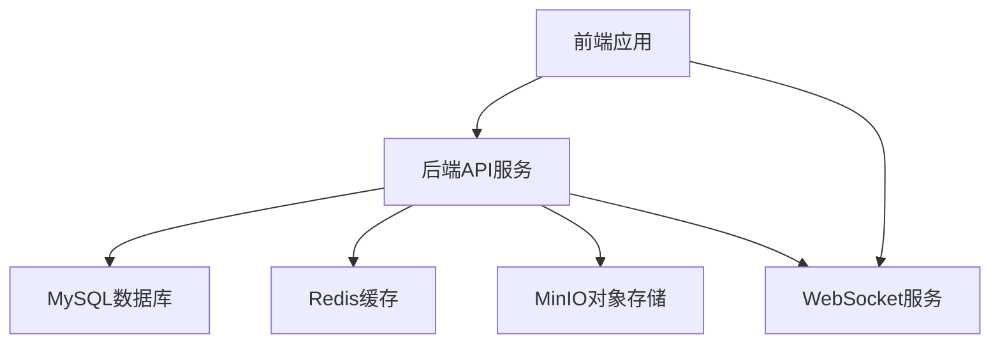
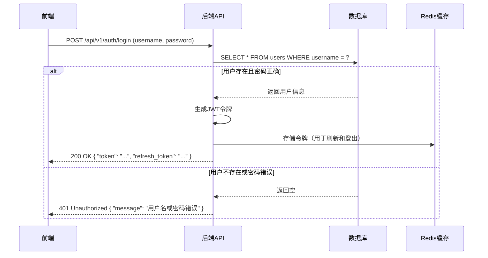
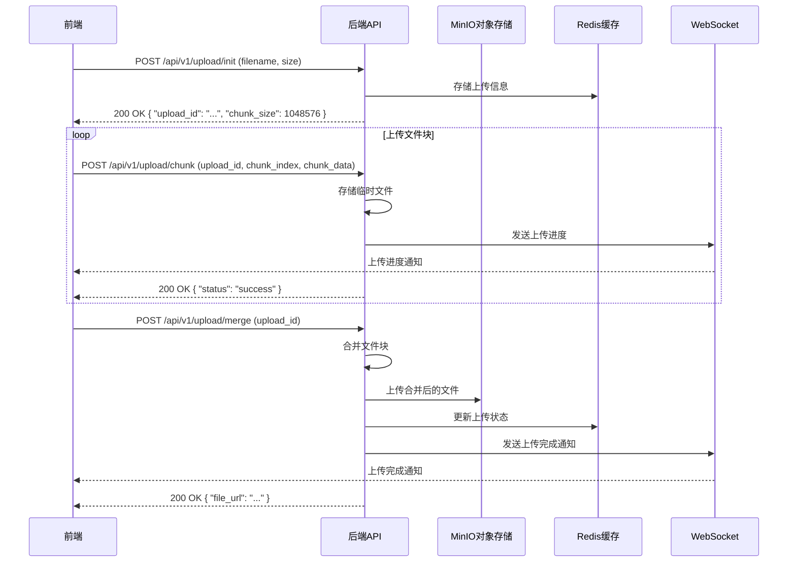
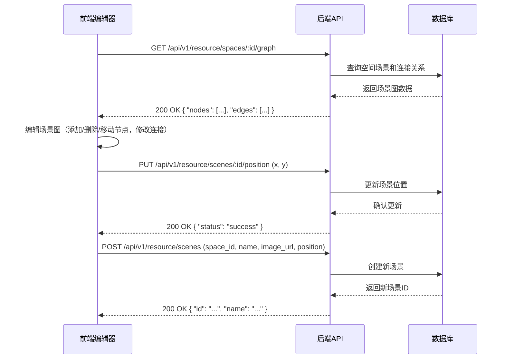

# WebGL-720yun 项目 Code Wiki

## 1. 项目概述

WebGL-720yun 是一个基于WebGL技术的720云全景展示平台，支持全景图的上传、展示和交互。项目采用前后端分离架构，使用Docker容器化部署，确保开发环境的一致性和便捷性。

主要功能包括：
- 全景图上传与管理
- 720度全景展示
- 场景与热点管理
- 用户认证与授权
- 空间管理与可视化编辑

## 2. 项目架构

### 2.1 整体架构

项目采用经典的前后端分离架构，具体如下：



### 2.2 目录结构

#### 后端结构

| 目录/文件 | 职责 | 说明 |
|----------|------|------|
| `backend/cmd/` | 命令行入口 | 包含主程序入口点 |
| `backend/config/` | 配置文件 | 包含开发和生产环境配置 |
| `backend/internal/` | 内部代码 | 核心业务逻辑 |
| `backend/internal/core/` | 核心功能 | 中间件、路由、数据库设置 |
| `backend/internal/model/` | 数据模型 | 数据库表结构定义 |
| `backend/internal/resource/` | 资源管理 | 场景、热点等资源的业务逻辑 |
| `backend/internal/upload/` | 文件上传 | 大文件分块上传功能 |
| `backend/internal/user/` | 用户管理 | 用户认证与授权 |
| `backend/pkg/` | 公共包 | 工具函数和第三方服务集成 |
| `backend/main.go` | 主入口 | 应用程序启动点 |

#### 前端结构

| 目录/文件 | 职责 | 说明 |
|----------|------|------|
| `frontend/src/` | 源码目录 | 前端应用代码 |
| `frontend/src/api/` | API请求 | 与后端通信的接口 |
| `frontend/src/components/` | 组件 | Vue组件 |
| `frontend/src/models/` | 类型定义 | TypeScript类型 |
| `frontend/src/router/` | 路由 | 页面路由配置 |
| `frontend/src/stores/` | 状态管理 | Pinia状态管理 |
| `frontend/src/utils/` | 工具函数 | 辅助功能 |
| `frontend/src/views/` | 页面 | 前端页面 |
| `frontend/src/main.ts` | 入口文件 | 前端应用启动点 |

## 3. 核心模块

### 3.1 用户模块

**职责**：处理用户认证、授权和用户管理功能。

**主要组件**：
- `UserService`：用户服务，处理用户相关业务逻辑
- `AuthMiddleware`：认证中间件，验证用户身份
- `RBACMiddleware`：权限中间件，控制用户权限

**关键API**：
- `POST /api/v1/auth/login`：用户登录
- `POST /api/v1/auth/refresh`：刷新令牌
- `POST /api/v1/user/register`：用户注册
- `GET /api/v1/user/profile`：获取用户资料
- `PUT /api/v1/user/profile`：更新用户资料
- `POST /api/v1/user/change-password`：修改密码
- `POST /api/v1/user/logout`：用户登出
- `GET /api/v1/user/admin/list`：获取用户列表（管理员）
- `POST /api/v1/user/admin/batch-register`：批量注册用户（管理员）

### 3.2 资源模块

**职责**：管理空间、场景和热点等资源。

**主要组件**：
- `SpaceService`：空间服务，管理空间资源
- `SceneService`：场景服务，管理场景资源
- `HotspotService`：热点服务，管理热点资源

**关键API**：
- `GET /api/v1/resource/spaces`：获取空间列表
- `POST /api/v1/resource/spaces`：创建空间
- `GET /api/v1/resource/spaces/:id`：获取空间详情
- `GET /api/v1/resource/spaces/:id/graph`：获取空间场景图
- `PUT /api/v1/resource/spaces/:id`：更新空间
- `DELETE /api/v1/resource/spaces/:id`：删除空间
- `GET /api/v1/resource/scenes`：获取场景列表
- `POST /api/v1/resource/scenes`：创建场景
- `GET /api/v1/resource/scenes/:id`：获取场景详情
- `PUT /api/v1/resource/scenes/:id`：更新场景
- `PUT /api/v1/resource/scenes/:id/position`：更新场景位置
- `DELETE /api/v1/resource/scenes/:id`：删除场景
- `POST /api/v1/resource/scenes/batch-import`：批量导入场景
- `GET /api/v1/resource/hotspots`：获取热点列表
- `POST /api/v1/resource/hotspots`：创建热点
- `GET /api/v1/resource/hotspots/:id`：获取热点详情
- `PUT /api/v1/resource/hotspots/:id`：更新热点
- `DELETE /api/v1/resource/hotspots/:id`：删除热点

### 3.3 上传模块

**职责**：处理大文件分块上传。

**主要组件**：
- `UploadService`：上传服务，处理文件上传逻辑
- `WebSocket`：实时通信，用于上传进度通知

**关键API**：
- `POST /api/v1/upload/init`：初始化上传
- `POST /api/v1/upload/chunk`：上传文件块
- `POST /api/v1/upload/merge`：合并文件块
- `GET /api/v1/upload/status/:upload_id`：获取上传状态
- `DELETE /api/v1/upload/:upload_id`：取消上传
- `GET /api/v1/ws`：WebSocket连接

### 3.4 全景展示模块

**职责**：基于WebGL技术展示720度全景图。

**主要组件**：
- `PanoramaViewer`：前端全景查看器组件
- `SceneGraphEditor`：场景图编辑器

## 4. 关键类与函数

### 4.1 后端核心类

#### UserService

**职责**：处理用户相关业务逻辑。

**主要方法**：
- `Login`：用户登录
- `Register`：用户注册
- `GetProfile`：获取用户资料
- `UpdateProfile`：更新用户资料
- `ChangePassword`：修改密码
- `Logout`：用户登出
- `GetUserList`：获取用户列表
- `GetUserByID`：根据ID获取用户
- `UpdateUser`：更新用户信息
- `DeleteUser`：删除用户
- `DeleteUserBatch`：批量删除用户
- `BatchRegister`：批量注册用户

#### SpaceService

**职责**：管理空间资源。

**主要方法**：
- `GetSpaceList`：获取空间列表
- `GetSpaceDetail`：获取空间详情
- `CreateSpace`：创建空间
- `UpdateSpace`：更新空间
- `DeleteSpace`：删除空间
- `DeleteSpaceBatch`：批量删除空间

#### SceneService

**职责**：管理场景资源。

**主要方法**：
- `GetSceneList`：获取场景列表
- `GetSceneDetail`：获取场景详情
- `CreateScene`：创建场景
- `UpdateScene`：更新场景
- `UpdateScenePosition`：更新场景位置
- `BatchUpdateScenePosition`：批量更新场景位置
- `DeleteScene`：删除场景
- `BatchImportScenes`：批量导入场景
- `GetSpaceGraph`：获取空间场景图

#### HotspotService

**职责**：管理热点资源。

**主要方法**：
- `GetHotspotList`：获取热点列表
- `GetHotspotDetail`：获取热点详情
- `CreateHotspot`：创建热点
- `UpdateHotspot`：更新热点
- `DeleteHotspot`：删除热点

#### UploadService

**职责**：处理文件上传逻辑。

**主要方法**：
- `InitUpload`：初始化上传
- `UploadChunk`：上传文件块
- `MergeChunks`：合并文件块
- `GetUploadStatus`：获取上传状态
- `CancelUpload`：取消上传

### 4.2 前端核心组件

#### PanoramaViewer

**职责**：展示720度全景图。

**主要功能**：
- 全景图渲染
- 视角控制
- 热点交互

#### SceneGraphEditor

**职责**：编辑空间场景图。

**主要功能**：
- 场景节点管理
- 场景连接关系编辑
- 场景位置调整

#### AdminLayout

**职责**：管理员页面布局。

**主要功能**：
- 侧边菜单
- 权限控制
- 导航管理

#### UserManagement

**职责**：用户管理页面。

**主要功能**：
- 用户列表展示
- 用户创建与编辑
- 用户删除
- 批量操作

#### SpaceManagement

**职责**：空间管理页面。

**主要功能**：
- 空间列表展示
- 空间创建与编辑
- 空间删除
- 空间场景图查看

#### SceneManagement

**职责**：场景管理页面。

**主要功能**：
- 场景列表展示
- 场景创建与编辑
- 场景删除
- 批量导入场景

## 5. 技术栈与依赖

### 5.1 后端技术栈

| 技术/框架 | 版本 | 用途 | 备注 |
|---------|------|------|------|
| Go | 1.25.3 | 后端开发语言 | 容器化环境使用 |
| Gin | v1.11.0 | Web框架 | 路由处理、中间件支持 |
| GORM | v1.31.1 | ORM框架 | 数据库操作 |
| MySQL | 8.0 | 关系型数据库 | 存储用户数据、全景图元数据 |
| Redis | 7.0 | 缓存数据库 | 会话管理、缓存热点数据 |
| JWT | v5.3.0 | 身份认证 | 用户登录、权限验证 |
| Viper | v1.21.0 | 配置管理 | 读取配置文件 |
| Logrus | v1.9.3 | 日志管理 | 系统日志记录 |
| Zap | v1.27.0 | 高性能日志 | Gin中间件日志 |
| MinIO | - | 对象存储 | 存储全景图文件 |
| WebSocket | - | 实时通信 | 上传进度通知 |

### 5.2 前端技术栈

| 技术/框架 | 版本 | 用途 | 备注 |
|---------|------|------|------|
| Vue | 3.5.12 | 前端框架 | 组件化开发 |
| TypeScript | ~5.6.2 | 类型安全 | 静态类型检查 |
| Vite | 5.4.9 | 构建工具 | 快速开发、热更新 |
| Element Plus | 2.12.0 | UI组件库 | 表单、按钮等组件 |
| Pinia | 3.0.3 | 状态管理 | 全局状态管理 |
| Vue Router | 4.5.1 | 路由管理 | 单页应用路由 |
| Axios | 1.12.2 | HTTP客户端 | API请求 |
| Tailwind CSS | 4.1.18 | CSS框架 | 样式开发 |
| Sass | 1.95.0 | CSS预处理器 | 高级样式语法 |
| TDesign | - | UI组件库 | 表格、表单等组件 |

### 5.3 容器化技术

| 技术 | 版本 | 用途 | 备注 |
|-----|------|------|------|
| Docker | 最新 | 容器化平台 | 服务隔离、环境一致性 |
| Docker Compose | 最新 | 容器编排 | 多服务管理、一键部署 |
| Nginx | alpine | Web服务器 | 静态资源服务、API反向代理 |

## 6. 项目运行与部署

### 6.1 开发环境

**使用Docker Compose启动**：

```bash
# 克隆项目
git clone <项目仓库地址>
cd webGL-720yun

# 开发环境启动（推荐）
docker-compose -f docker-compose.yml -f docker-compose.dev.yml up -d

# 开发环境启动并构建（首次运行或修改Dockerfile后）
docker-compose -f docker-compose.yml -f docker-compose.dev.yml up -d --build

# 开发环境访问地址：
# - 前端：http://localhost:8080
# - 后端API：http://localhost:7000
# - MySQL：localhost:3307（容器内部3306）
# - Redis：localhost:6379
```

**本地开发**：

**后端**：
1. 进入后端目录：`cd backend`
2. 安装依赖：`go mod tidy`
3. 运行服务：`go run cmd/main.go` 或使用 `air` 实现热重载

**前端**：
1. 进入前端目录：`cd frontend`
2. 安装依赖：`npm install`
3. 运行开发服务器：`npm run dev`
4. 服务将在 http://localhost:5173 启动

### 6.2 生产环境

**使用Docker Compose启动**：

```bash
# 生产环境启动
docker-compose -f docker-compose.yml -f docker-compose.prod.yml up -d

# 生产环境启动并构建
docker-compose -f docker-compose.yml -f docker-compose.prod.yml up -d --build

# 生产环境访问地址：
# - 前端：http://localhost 或 https://localhost
# - 后端API：http://localhost/api 或 https://localhost/api
```

**构建生产镜像**：

```bash
# 构建后端镜像
docker build -t webgl-720yun-backend:prod ./backend

# 构建前端镜像
docker build -t webgl-720yun-frontend:prod ./frontend
```

### 6.3 停止服务

```bash
# 停止开发环境服务
docker-compose -f docker-compose.yml -f docker-compose.dev.yml down

# 停止生产环境服务
docker-compose -f docker-compose.yml -f docker-compose.prod.yml down

# 停止并删除数据卷（谨慎使用）
docker-compose -f docker-compose.yml -f docker-compose.dev.yml down -v
```

### 6.4 查看日志

```bash
# 查看开发环境日志
docker-compose -f docker-compose.yml -f docker-compose.dev.yml logs -f

# 查看生产环境日志
docker-compose -f docker-compose.yml -f docker-compose.prod.yml logs -f

# 查看特定服务日志
docker-compose -f docker-compose.yml -f docker-compose.dev.yml logs -f frontend
```

## 7. 核心流程

### 7.1 用户认证流程



### 7.2 文件上传流程



### 7.3 场景图编辑流程



## 8. 配置管理

### 8.1 后端配置

后端配置文件位于 `backend/config/` 目录：

- `config.dev.yaml`：开发环境配置
- `config.prod.yaml`：生产环境配置

主要配置项包括：
- 服务器配置（端口、超时等）
- 数据库配置（主机、端口、用户名、密码等）
- Redis配置（主机、端口、密码等）
- JWT配置（密钥、过期时间等）
- MinIO配置（端点、访问密钥、存储桶等）
- 日志配置（级别、输出等）
- 无认证路径配置

### 8.2 前端配置

前端配置主要通过环境变量和Vite配置文件管理：

- `vite.config.ts`：Vite构建配置
- `.env`：开发环境变量
- `.env.production`：生产环境变量

## 9. 监控与日志

### 9.1 后端日志

后端使用Logrus和Zap进行日志管理：

- 系统日志：使用Logrus记录应用级别的日志
- HTTP请求日志：使用Zap记录HTTP请求和响应

日志级别包括：DEBUG、INFO、WARN、ERROR、FATAL

### 9.2 前端日志

前端使用浏览器控制台和应用内部日志系统：

- 开发环境：详细日志输出到控制台
- 生产环境：只输出错误和警告信息

## 10. 安全措施

### 10.1 认证与授权

- 使用JWT进行身份认证
- 实现RBAC（基于角色的访问控制）
- 密码加密存储
- 令牌过期机制
- 令牌刷新机制

### 10.2 数据安全

- HTTPS加密传输
- 输入验证与 sanitization
- SQL注入防护（使用GORM参数化查询）
- CSRF防护
- 敏感信息脱敏

### 10.3 上传安全

- 文件类型验证
- 文件大小限制
- 分块上传防止大文件攻击
- 临时文件清理

## 11. 扩展性与维护

### 11.1 代码规范

- 后端：遵循Go语言规范，使用go fmt和go vet
- 前端：遵循TypeScript和Vue规范，使用ESLint和Prettier

### 11.2 测试策略

- 单元测试：使用Go testing和Jest
- 集成测试：使用Docker Compose模拟完整环境
- API测试：使用curl或Postman

### 11.3 部署策略

- 容器化部署：使用Docker和Docker Compose
- 环境分离：开发、测试、生产环境分离
- 持续集成/持续部署：可集成CI/CD pipeline

### 11.4 扩展建议

- 引入缓存层：使用Redis缓存热点数据
- 引入消息队列：处理异步任务
- 引入监控系统：Prometheus + Grafana
- 引入日志聚合：ELK Stack
- 引入CDN：加速静态资源和媒体文件访问

## 12. 常见问题与解决方案

### 12.1 上传失败

**问题**：文件上传失败，显示网络错误

**解决方案**：
- 检查网络连接
- 检查文件大小是否超过限制
- 检查文件类型是否被允许
- 查看服务器日志获取详细错误信息

### 12.2 全景图加载缓慢

**问题**：全景图加载时间过长

**解决方案**：
- 优化图片大小和格式
- 使用CDN加速
- 实现图片懒加载
- 考虑使用渐进式加载

### 12.3 场景图编辑卡顿

**问题**：编辑大型场景图时卡顿

**解决方案**：
- 优化前端渲染性能
- 实现场景图分层加载
- 减少DOM操作
- 使用WebWorker处理复杂计算

### 12.4 认证失败

**问题**：登录后很快需要重新登录

**解决方案**：
- 检查JWT过期时间配置
- 检查Redis连接状态
- 检查浏览器cookie设置
- 检查网络请求是否包含认证头

## 13. 总结与亮点回顾

WebGL-720yun 项目是一个功能完整、架构清晰的720云全景展示平台，具有以下亮点：

1. **技术栈现代化**：采用Go、Vue 3、TypeScript等现代技术，确保项目的可维护性和扩展性。

2. **架构设计合理**：前后端分离架构，职责清晰，便于团队协作和代码维护。

3. **功能完整**：支持全景图上传、展示、场景管理、热点管理等核心功能。

4. **用户体验优秀**：实时上传进度、交互式场景图编辑、流畅的全景浏览体验。

5. **部署便捷**：Docker容器化部署，支持开发和生产环境快速切换。

6. **安全性高**：实现了完整的认证授权机制和数据安全措施。

7. **可扩展性强**：模块化设计，易于添加新功能和集成第三方服务。

8. **性能优化**：分块上传、缓存策略、前端性能优化等措施确保系统运行流畅。

该项目不仅满足了720云全景展示的核心需求，也为类似项目的开发提供了参考架构和最佳实践。