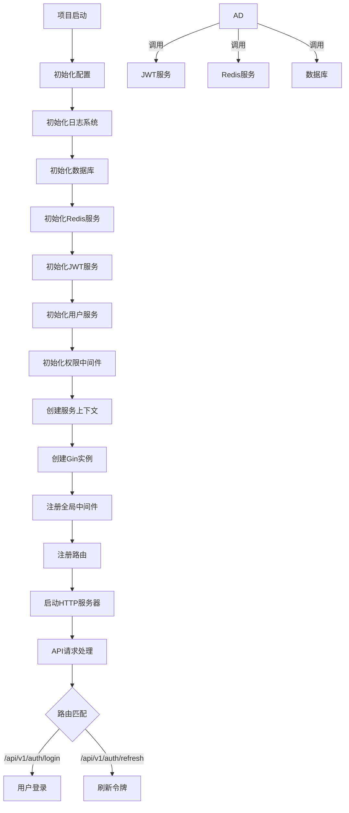

# webGL-720yun
仿720云构建的VR网站

[详细文档  模仿720云构建的VR网站](https://wqh9xucdd05.feishu.cn/docx/VvfFdizMEocNhdxyfcRc8J9bncc)

```mermaid
flowchart TD
    %% 项目启动流程
    A[项目启动] --> B[初始化配置]
    B --> C[初始化日志系统]
    C --> D[初始化数据库]
    D --> E[初始化Redis服务]
    E --> F[初始化JWT服务]
    F --> G[初始化用户服务]
    G --> H[初始化权限中间件]
    H --> I[创建服务上下文]
    I --> J[创建Gin实例]
    J --> K[注册全局中间件]
    K --> L[注册路由]
    L --> M[启动HTTP服务器]
    
    %% API服务结构
    M --> N[API请求处理]
    N --> O{路由匹配}
    
    %% 认证路由
    O -->|/api/v1/auth/login| P[用户登录]
    O -->|/api/v1/auth/refresh| Q[刷新令牌]
    
  
    
   
    AD -->|调用| AE[JWT服务]
    AD -->|调用| AF[Redis服务]
    AD -->|调用| AG[数据库]
    
   
```