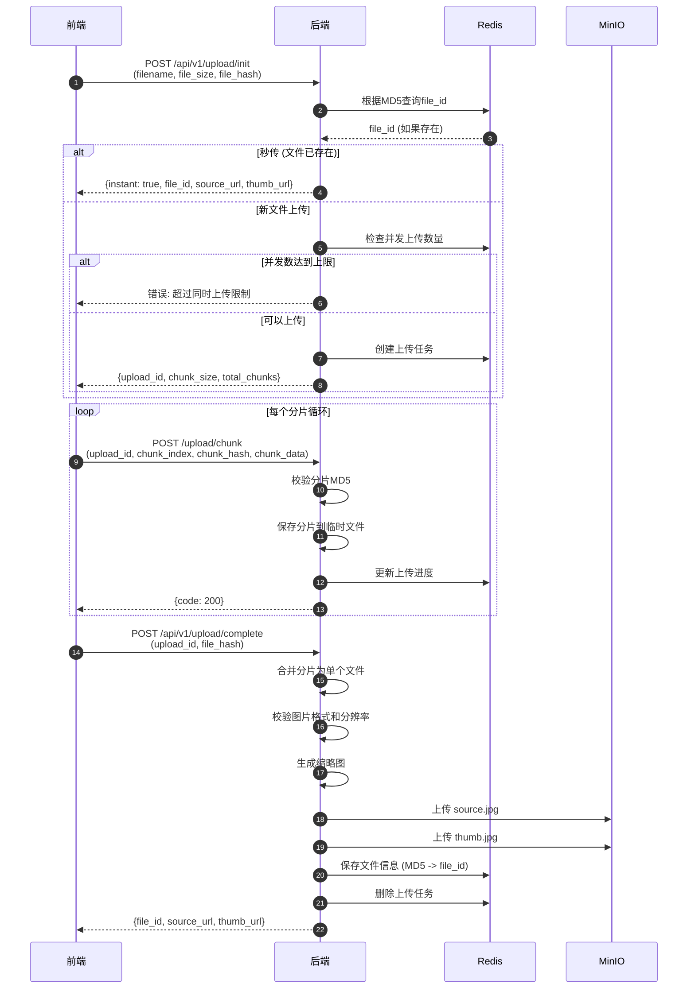
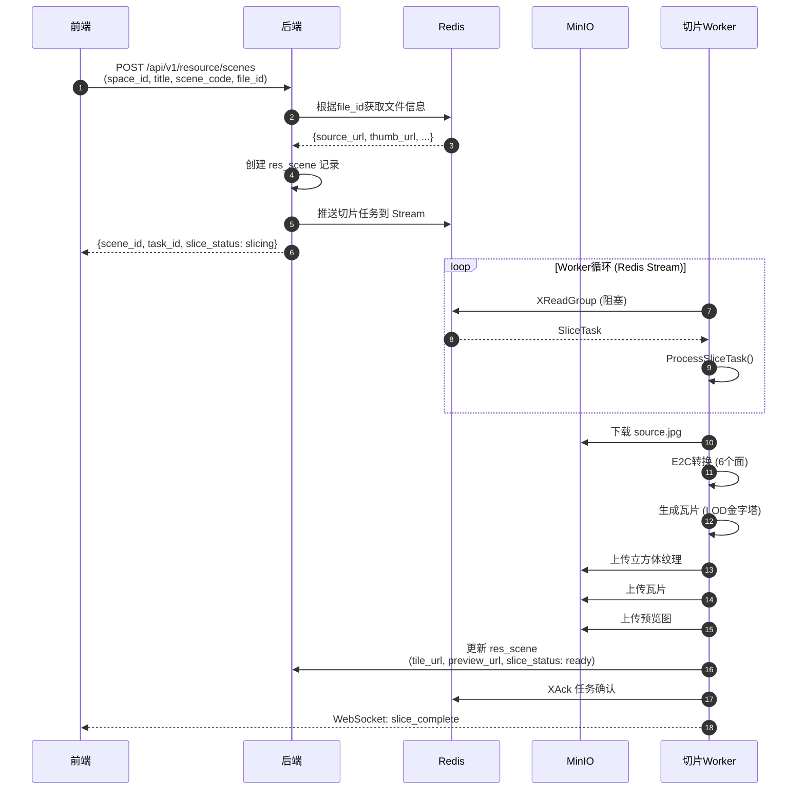
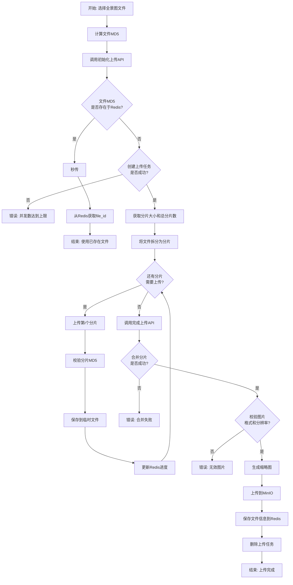
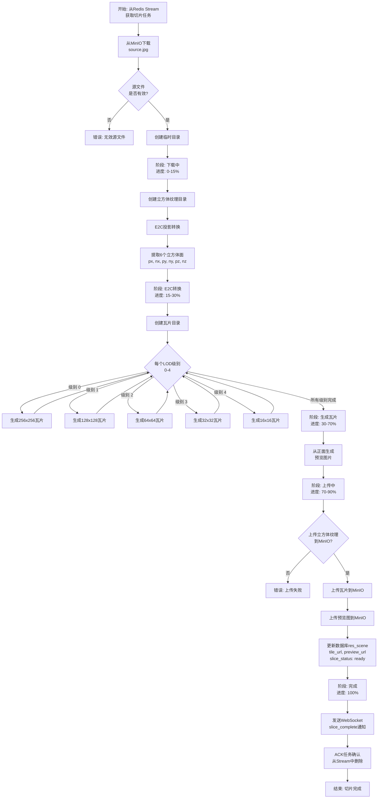
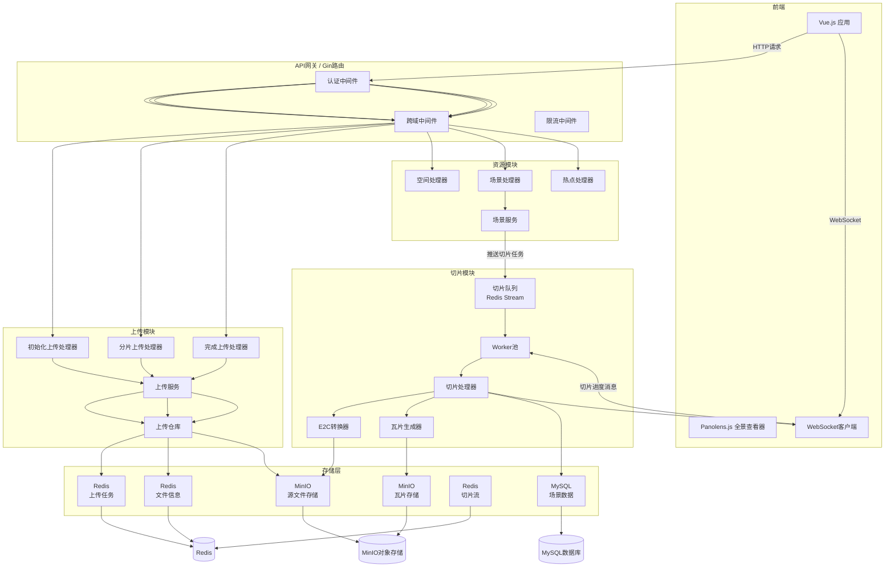
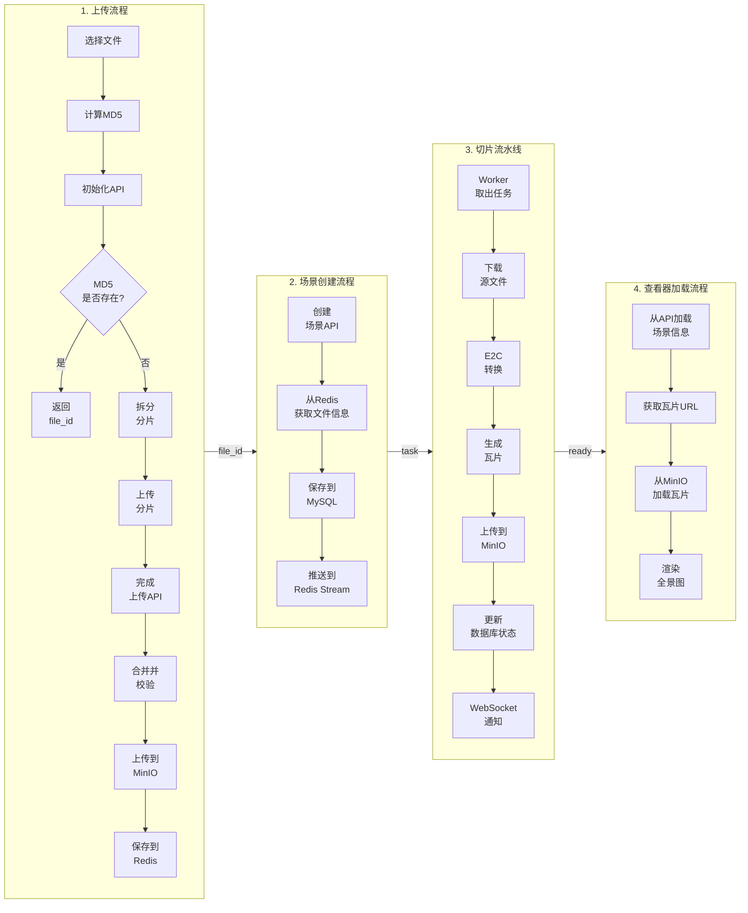
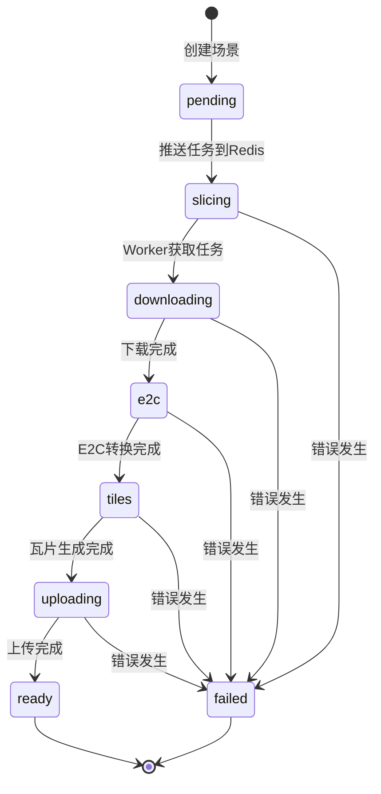
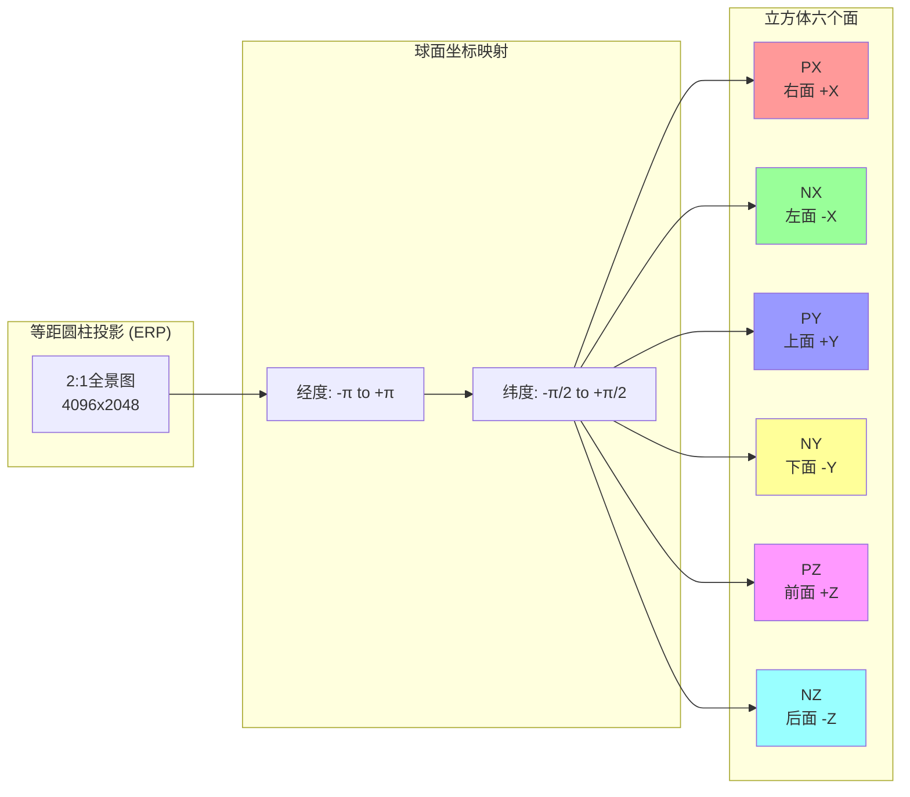
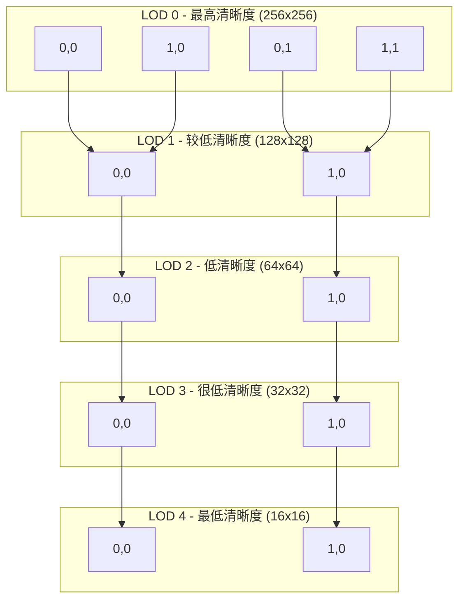

# 全景上传与切片架构

## 1. 上传模块时序图



## 2. 场景创建与切片流水线时序图



## 3. 分片上传流程图



## 4. 切片流水线流程图



## 5. 系统架构图



## 6. 数据流架构图



## 7. Redis数据结构

```mermaid
erDiagram
    Redis上传任务 ||--o| Redis文件信息 : "映射关系"
    Redis文件信息 {
        string file_id 主键
        string source_url 源文件URL
        string thumb_url 缩略图URL
        int file_size 文件大小
        int width 图片宽度
        int height 图片高度
        timestamp created_at 创建时间
    }
    Redis上传任务 {
        string upload_id 主键
        string file_hash 文件MD5
        int total_chunks 总分片数
        int uploaded_chunks 已上传分片数
        string status 状态
        timestamp created_at 创建时间
    }
    RedisMD5索引 {
        string file_md5 主键
        string file_id 外键
    }
    Redis切片流 {
        string stream_key 流键
        string task_id 任务ID
        uint scene_id 场景ID
        string file_id 文件ID
        uint user_id 用户ID
        timestamp created_at 创建时间
    }
```

## 8. 场景切片状态机



## 9. E2C转换原理图



## 10. LOD瓦片金字塔


