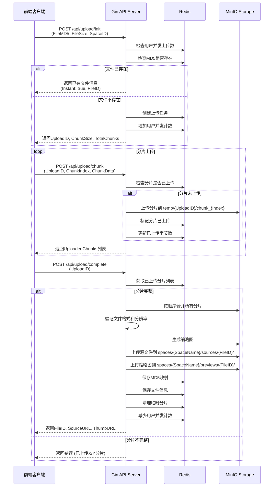
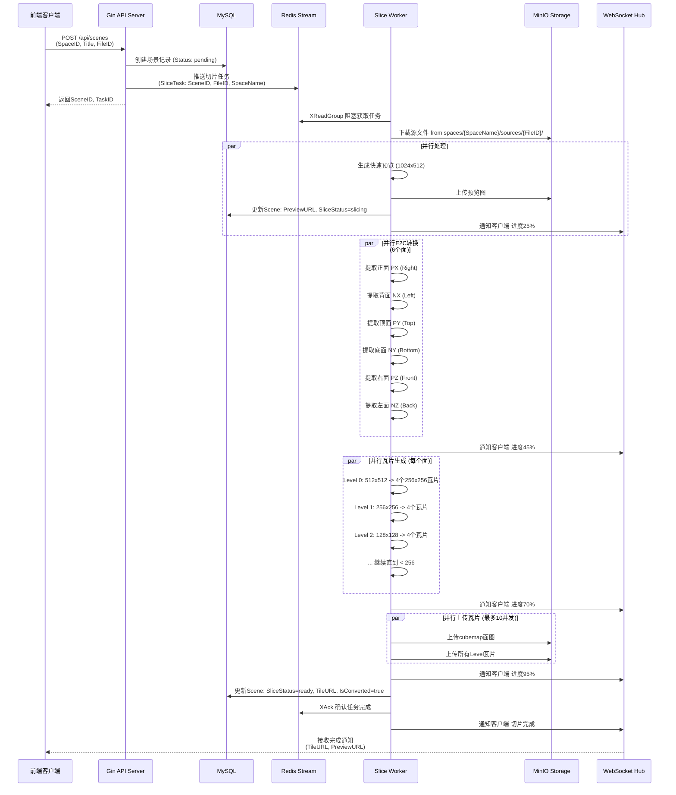
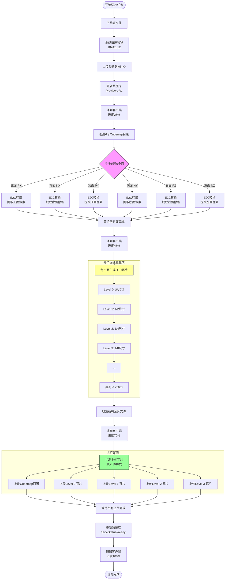
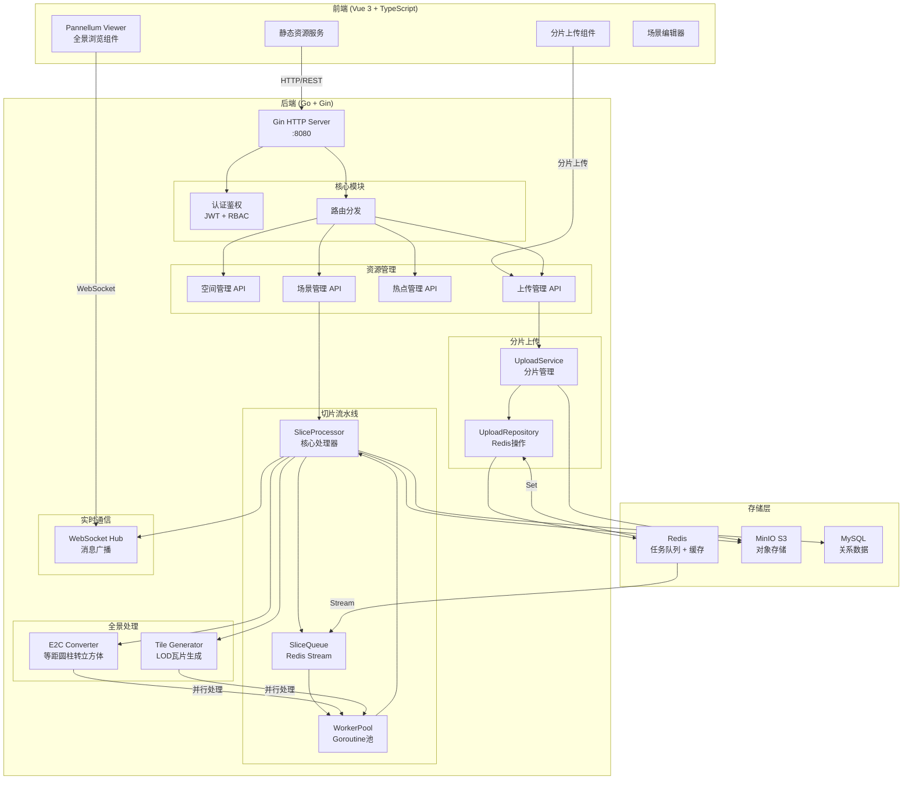
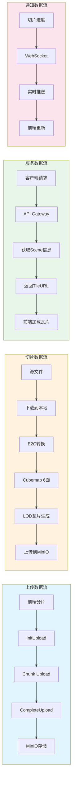
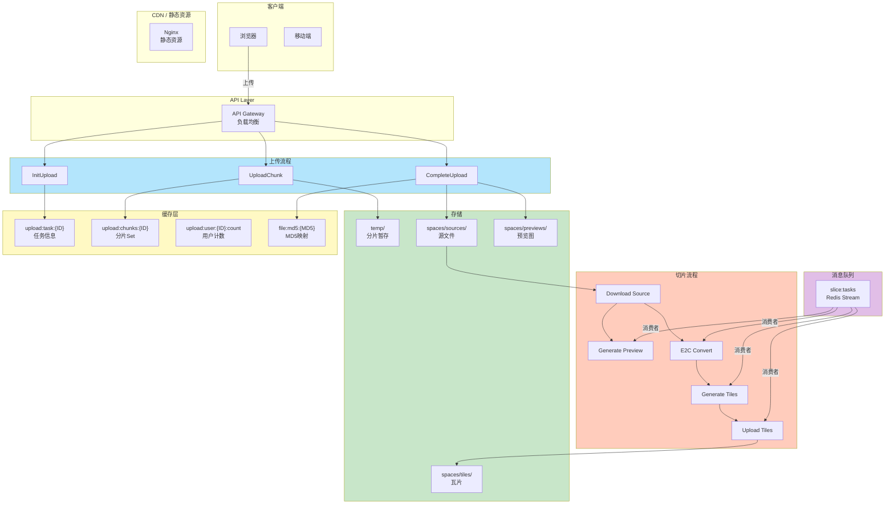
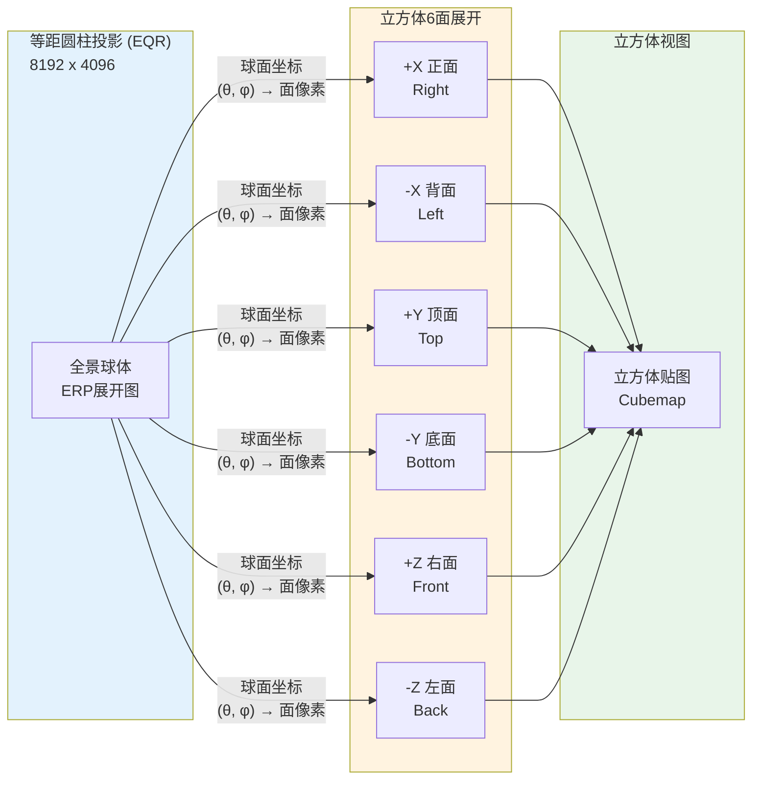
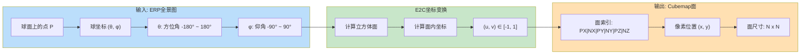
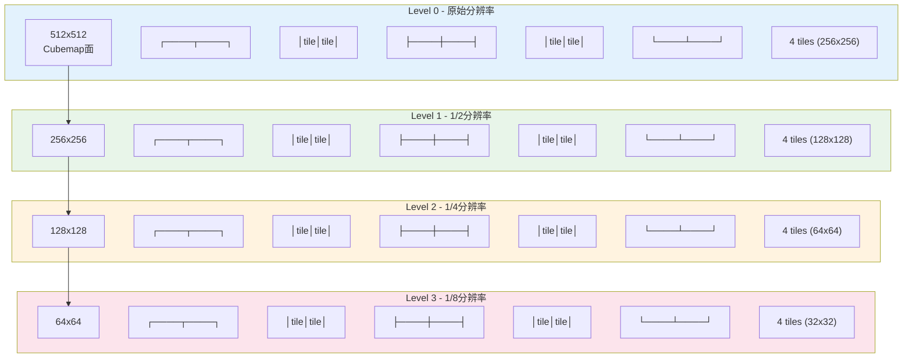
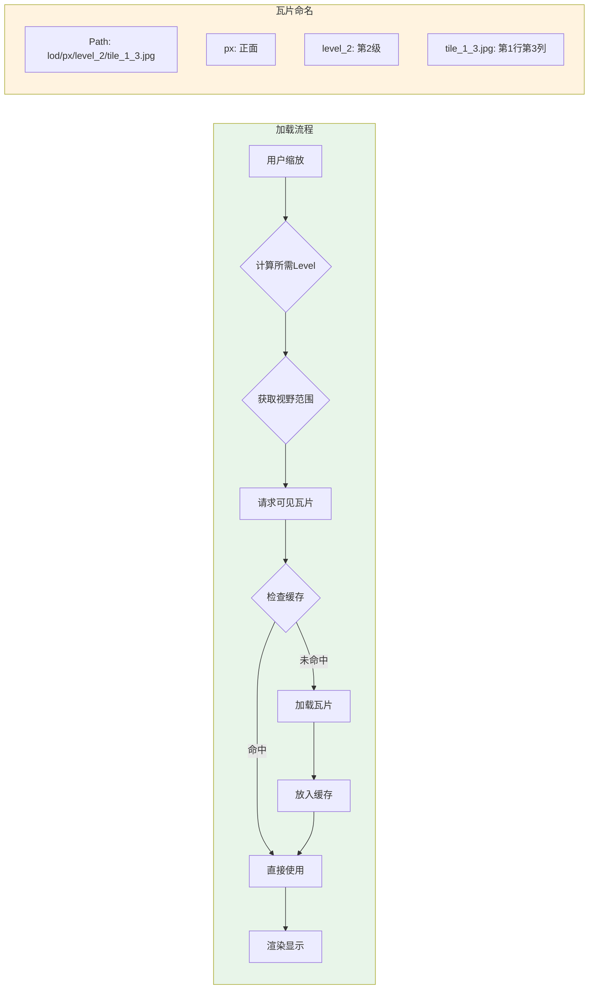

# 全景系统架构文档

## 目录

1. [上传模块时序图](#1-上传模块时序图)
2. [场景创建与切片流水线时序图](#2-场景创建与切片流水线时序图)
3. [分片上传流程图](#3-分片上传流程图)
4. [切片流水线流程图](#4-切片流水线流程图)
5. [系统架构图](#5-系统架构图)
6. [数据流架构图](#6-数据流架构图)
7. [Redis数据结构](#7-redis数据结构)
8. [场景切片状态机](#8-场景切片状态机)
9. [E2C转换原理图](#9-e2c转换原理图)
10. [LOD瓦片金字塔](#10-lod瓦片金字塔)

---

## 1. 上传模块时序图



---

## 2. 场景创建与切片流水线时序图



---

## 3. 分片上传流程图

```mermaid
flowchart TD
    A[开始上传] --> B[前端计算文件MD5]
    B --> C[调用InitUpload接口]
    C --> D{检查MD5是否存在?}

    D -->|是| E[秒传成功<br/>返回已有文件信息]
    D -->|否| F[创建上传任务<br/>返回UploadID]

    F --> G[将文件分片<br/>每片5MB]
    G --> H{还有未上传分片?}

    H -->|是| I[上传分片到MinIO<br/>temp/{UploadID}/chunk_{Index}]
    I --> J{上传成功?}

    J -->|否| K[重试最多3次]
    K --> I
    J -->|是| L[更新Redis分片状态]
    L --> H

    H -->|否| M[调用CompleteUpload]
    M --> N[按顺序合并分片]
    N --> O[验证文件格式和分辨率]
    O --> P{验证通过?}

    P -->|否| Q[返回错误<br/>清理临时文件]
    P -->|是| R[生成缩略图]
    R --> S[上传源文件到正式目录]
    S --> T[上传缩略图]
    T --> U[保存MD5映射到Redis]
    U --> V[清理临时分片]
    V --> W([上传完成])

    E --> W
```

---

## 4. 切片流水线流程图



---

## 5. 系统架构图



---

## 6. 数据流架构图





---

## 7. Redis数据结构

```mermaid
erDiagram
    REDIS_DATASETS ||--|| UPLOAD_TASK : stores
    REDIS_DATASETS ||--|| UPLOAD_CHUNKS : stores
    REDIS_DATASETS ||--|| USER_UPLOAD_COUNT : tracks
    REDIS_DATASETS ||--|| FILE_MD5 : maps
    REDIS_DATASETS ||--|| SLICE_STREAM : manages

    UPLOAD_TASK {
        string key "upload:task:{UploadID}"
        hash value "TaskID, UserID, SpaceID, FileName,<br/>FileSize, FileMD5, TotalChunks,<br/>ChunkSize, Status, UploadedBytes"
        int ttl "48小时"
    }

    UPLOAD_CHUNKS {
        string key "upload:chunks:{UploadID}"
        set value "ChunkIndex列表"
        int ttl "48小时"
    }

    USER_UPLOAD_COUNT {
        string key "upload:user:{UserID}:count"
        int value "当前并发上传数"
        int ttl "无"
    }

    FILE_MD5 {
        string key "file:md5:{MD5}"
        string value "FileID"
        int ttl "永不过期"
    }

    FILE_INFO {
        string key "file:info:{FileID}"
        hash value "FileID, SpaceID, SpaceName,<br/>SourceURL, ThumbURL, FileSize,<br/>Width, Height, CreatedAt"
        int ttl "30天"
    }

    SLICE_STREAM {
        stream key "slice:tasks"
        entry field "data: JSON序列化任务"
        consumer_group "slice_workers"
    }
```

```mermaid
mindmap
    root((Redis数据结构))
        上传任务
            upload:task:{UploadID}
            Hash存储
                TaskID
                UserID
                SpaceID
                FileName
                FileSize
                TotalChunks
                Status
            TTL: 48小时
        分片状态
            upload:chunks:{UploadID}
            Set存储
            每个元素是分片索引
            TTL: 48小时
        用户上传计数
            upload:user:{UserID}:count
            String整数
            INCR/DECR操作
        MD5映射
            file:md5:{MD5}
            String存储FileID
            秒传依据
        切片任务流
            slice:tasks
            Stream类型
            XADD添加任务
            XReadGroup消费
            XAck确认完成
        用户会话
            user:session:{UserID}
            Hash存储
            access_token
            refresh_token
        在线状态
            user:online:{UserID}
            String "1"
            TTL管理
```

---

## 8. 场景切片状态机

```mermaid
stateDiagram-v2
    [*] --> Pending : 创建场景

    Pending --> Slicing : 开始切片
    Slicing --> Ready : 切片完成
    Slicing --> Failed : 切片失败
    Failed --> Slicing : 重试

    Ready --> [*] : 删除场景

    note right of Pending
        初始状态
        等待Worker接收任务
    end

    note right of Slicing
        处理中状态
        包含多个阶段:
        - 下载源文件 (5%)
        - 生成预览 (15%)
        - E2C转换 (30%)
        - 瓦片生成 (50%)
        - 上传瓦片 (75%)
        - 完成 (95%)
    end

    note right of Ready
        切片完成
        可供前端加载
        TileURL已设置
        IsConverted=true
    end

    note right of Failed
        切片失败
        可重试3次
        保存错误信息
    end
```

---

## 9. E2C转换原理图





```mermaid
graph TD
    subgraph 面索引计算
        A["输入点 P(θ, φ)"] --> B{cos(φ) ≥ sin(θ)?}
        B -->|是 且 cos(φ) ≥ -sin(θ)| PX["PX (+X)<br/>u = 1/z<br/>v = y/|z|"]
        B -->|是 且 cos(φ) < -sin(θ)| NX["NX (-X)<br/>u = -1/z<br/>v = y/|z|"]
        B -->|否| C{sin(φ) ≥ 0?}
        C -->|是| PY["PY (+Y)<br/>u = x/|y|<br/>v = -1/z"]
        C -->|否| NY["NY (-Y)<br/>u = x/|y|<br/>v = 1/z"]
        D{"cos(φ) ≥ cos(θ)?"} -->|是| PZ["PZ (+Z)<br/>u = x/|z|<br/>v = y/|z|"]
        D -->|否| NZ["NZ (-Z)<br/>u = -x/|z|<br/>v = y/|z|"]
    end

    style PX fill:#ffcdd2
    style NX fill:#f8bbd0
    style PY fill:#fff9c4
    style NY fill:#ffe082
    style PZ fill:#c8e6c9
    style NZ fill:#b2dfdb
```

---

## 10. LOD瓦片金字塔



```mermaid
mindmap
    root((LOD瓦片<br/>金字塔))
        存储结构
            MinIO路径
            spaces/{SpaceName}/tiles/{SceneCode}/cubemap/{face}.jpg
            spaces/{SpaceName}/tiles/{SceneCode}/lod/{face}/level_{N}/tile_{row}_{col}.jpg
        瓦片规格
            标准瓦片大小
            256 x 256 像素
            JPEG格式
            质量85%
        LOD层级
            Level 0: 512x512 (2x2)
            Level 1: 256x256 (2x2)
            Level 2: 128x128 (2x2)
            Level 3: 64x64 (2x2)
            Level 4: 32x32 (2x2)
            直到 < 256px
        加载策略
            远距离 → 低层级
            近距离 → 高层级
            渐进式加载
            视锥体剔除
        前端渲染
            Pannellum支持
            WebGL渲染
            球面坐标映射
```



---

## 附录: 相关文件索引

| 模块 | 文件路径 | 说明 |
|-----|---------|-----|
| 分片上传 | [upload_service.go](file:///d:/lwdd/code/毕设/webGL-720yun/backend/internal/resource/upload/upload_service.go) | 分片上传核心服务 |
| 分片仓库 | [upload_repository.go](file:///d:/lwdd/code/毕设/webGL-720yun/backend/internal/resource/upload/upload_repository.go) | Redis操作封装 |
| 切片队列 | [queue.go](file:///d:/lwdd/code/毕设/webGL-720yun/backend/internal/slice/queue.go) | Redis Stream任务队列 |
| 切片处理器 | [processor.go](file:///d:/lwdd/code/毕设/webGL-720yun/backend/internal/slice/processor.go) | 切片流水线核心 |
| E2C转换 | [e2c.go](file:///d:/lwdd/code/毕设/webGL-720yun/backend/pkg/panorama/e2c.go) | 等距圆柱转立方体 |
| 立方体转换器 | [converter.go](file:///d:/lwdd/code/毕设/webGL-720yun/backend/pkg/panorama/converter.go) | 6面并行转换 |
| Redis服务 | [redis.go](file:///d:/lwdd/code/毕设/webGL-720yun/backend/pkg/redis/redis.go) | Redis操作封装 |
| 场景模型 | [resource.go](file:///d:/lwdd/code/毕设/webGL-720yun/backend/internal/model/resource.go) | 数据模型定义 |
