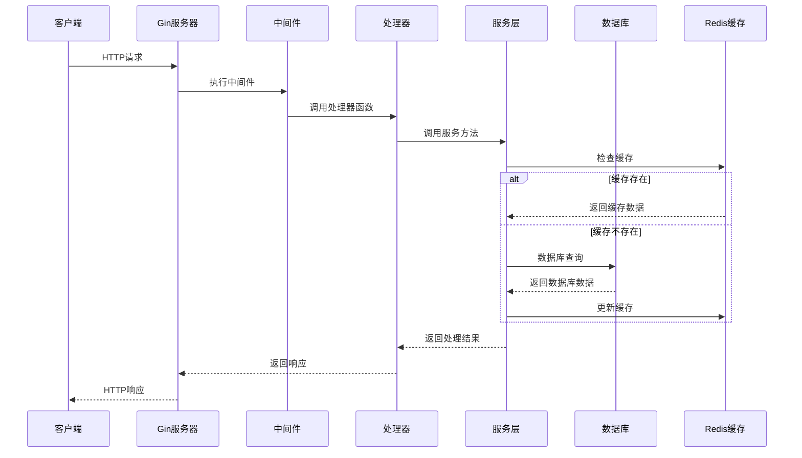

# Gin框架项目架构流程图

```mermaid
flowchart TD
    %% 项目启动流程（水平排列以压缩高度）
    A[项目启动] --> B[初始化配置
config.Init()]
    B --> C[初始化日志系统
logger.Setup()]
    C --> D[初始化数据库
 database.Init()]
    D --> E[初始化Redis服务
 redis.NewRedisService()]
    E --> F[初始化JWT服务
 jwt.NewJWTService()]
    
    %% 并行初始化服务
    F --> G[初始化用户服务
 user.NewUserService()]
    G --> H[初始化权限中间件
 middleware.NewAuthMiddleware()]
    H --> I[创建服务上下文
 services.NewServiceContext()]
    I --> J[创建Gin实例
 gin.New()]
    J --> K[注册全局中间件
 registerCoreMiddleware()]
    K --> L[注册路由
 routes.UserAPIRoutes()]
    L --> M[启动HTTP服务器
 srv.ListenAndServe()]
    
    %% API服务结构
    M --> N[API请求处理]
    
```

## 流程图说明

### 项目启动流程
1. **初始化配置**：加载并解析配置文件（config.dev.yaml或config.prod.yaml）
2. **初始化日志系统**：设置日志级别、文件路径等
3. **初始化数据库**：建立MySQL数据库连接
4. **初始化Redis服务**：建立Redis缓存连接
5. **初始化JWT服务**：配置JWT令牌生成和验证规则
6. **初始化用户服务**：创建用户业务逻辑服务
7. **初始化权限中间件**：配置认证和授权规则
8. **创建服务上下文**：统一管理所有服务实例
9. **创建Gin实例**：根据配置设置Gin模式（Debug/Release）
10. **注册全局中间件**：注册恢复中间件和日志中间件
11. **注册路由**：注册所有API路由
12. **启动HTTP服务器**：监听指定端口提供服务

### API服务结构

#### 认证路由（无需认证）
- `POST /api/v1/auth/login` - 用户登录
- `POST /api/v1/auth/refresh` - 刷新访问令牌

#### 用户路由
- **公开路由**：
  - `POST /api/v1/user/register` - 用户注册

- **需要认证的路由**：
  - `GET /api/v1/user/profile` - 获取用户资料
  - `PUT /api/v1/user/profile` - 更新用户资料
  - `POST /api/v1/user/change-password` - 修改密码
  - `POST /api/v1/user/logout` - 用户登出

- **管理员专属路由**：
  - `GET /api/v1/user/admin/list` - 获取用户列表
  - `GET /api/v1/user/admin/:id` - 获取用户详情
  - `POST /api/v1/user/admin/create` - 创建用户
  - `PUT /api/v1/user/admin/:id` - 更新用户
  - `DELETE /api/v1/user/admin/:id` - 删除用户

### 核心组件关系
- **ServiceContext**：服务上下文，统一管理所有服务实例
- **UserService**：用户业务逻辑服务
- **JWTService**：JWT令牌服务
- **RedisService**：Redis缓存服务
- **AuthMiddleware**：认证和授权中间件
- **GORM**：数据库ORM

### 数据流向
1. 客户端发送HTTP请求
2. Gin服务器接收请求并路由匹配
3. 经过中间件处理（认证、授权等）
4. 处理器函数调用服务层方法
5. 服务层调用数据层或其他服务
6. 返回响应给客户端

## 架构特点

1. **模块化设计**：各个功能模块独立，便于维护和扩展
2. **服务上下文**：统一管理服务实例，简化依赖注入
3. **中间件机制**：灵活的认证和授权控制
4. **多层架构**：控制器层、服务层、数据层分离
5. **缓存机制**：使用Redis缓存提高性能
6. **JWT认证**：无状态认证，便于水平扩展
7. **优雅关机**：支持服务平滑关闭
8. **配置管理**：支持不同环境的配置文件

# API请求处理流程


